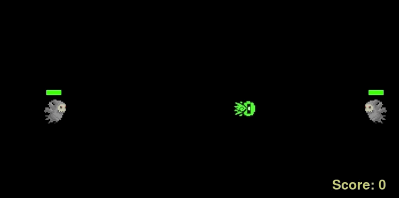
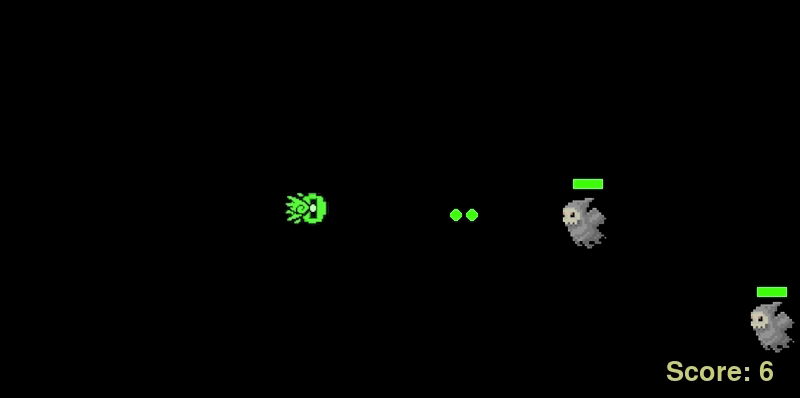

# Peter Pew Pew
A game using A* Pathfinding Algorithm and PyGame

                                               

## Player Instructions
Required Modules: PyGame 2.0.0.dev6 and Random

Kill ghosts to increase your score.
Press the ARROW keys to move player avatar. Press SPACEBAR to shoot.
You die when a ghost touches you. Shoot ghosts 3 times to kill them. 
At each point of time, you are only allowed to shoot 6 bullets. However, when you reach 40 points, you are able to shoot bullets both from the front and back, giving a total of 12 bullets. 
A new ghost spawns every time you kill a ghost. The chances of a double spawn increases every time your points increase by 10.

## A* Pathfinding Algorithm
It is built upon Dijkstra's Algorithm with an additional heuristic, called the 'h' function. The 'h' function is the distance of measurement between the a node and the goal node, and is most of the time calculated using the Manhattan Distance, which is much more efficient than using Euclidean Distance because of the formula's simplicity. Therefore, the 'h' distance will create a bias for nodes that are actually closer to the goal node, rather than giving equal weights to all nodes surrounding the previous node, giving the algorithm a "sense of direction".

## Difficulty Levels
The game difficulty increases as the game progresses. It is pegged to the player's score. For now, the chance of spawning two ghosts when one dies increases as the difficulty increases. This is done using random.randint. There are other ways you can increase its difficulty. For example, you could increase the fps of the game, which would result in higher refresh rates, making everything move faster, not only giving the player lesser control over his avatar but the ghosts will also move faster (try changing the fps to 60, it gets really crazy); or simply, increase the velocity of the ghosts.
